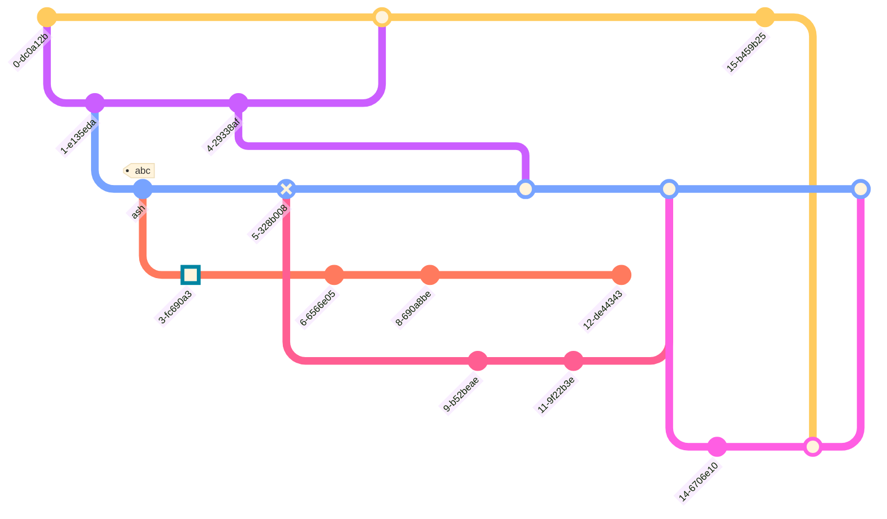

# [Dziban's Github page](https://github.com/dziban303)
This goes to a footnote for $\sqrt{3x-1}+(1+x)^2$ [^1]
## [TropicalWeather Discord server](https://discord.gg/tropicalweather)
### [/r/TropicalWeather](https://tropicalweather.reddit.com)

[^1]: Would you like to [know more?](https://docs.github.com/en/get-started/writing-on-github/working-with-advanced-formatting/writing-mathematical-expressions)

##### Basics
**Well** this is **kind _of_ fuckin'** *weird* __don't *you* think__ ~~because it~~ `oh nevermind` ok                

###### Keyboard shortcust
[here](https://docs.github.com/en/get-started/using-github/keyboard-shortcuts)

##### Color dots
The background color should be `#ffffff` for <sup>light mode</sup> and `#0d1117` for <sub>dork mode.</sub> HSL `hsl(212, 92%, 45%)` screech `rgb(9, 105, 218)`. No work

### Blocks, block sofc ode

Pythong
```python
@register(commands=['locate', 'find', 'latlng', 'latlong'])
class Locate(BaseWeather):
    elevation_api = "https://maps.googleapis.com/maps/api/elevation/json"
    #template = "{{ name|nc }}: {{ lat }}, {{ lng }} {{ 'Elevation'|tc }}: {{ elevation|int }}m ({{ elevation_ft|int }}ft)"
    template = "{{ name|nc }}: {{ lat }}, {{ lng }} | Sorry, the elevation shit is broken"

    def get_elevation(self, latlng):
        try:
```

##### python-traceback! yowl

```python-traceback
2022-07-10 22:48:55,856 INFO got command locate {'sender': 'dziban303', 'ident': ':dziban303!dziban303', 'mask': 'user/dziban303', 'chan': '#TropicalWeather', 'msg': 'locate charleston', 'command': 'locate', 'args': 'charleston', 'bot': <pythabot.Pythabot object at 0x7f842fa7f0>}
2022-07-10 22:48:56,381 ERROR 'elevation' is undefined
Traceback (most recent call last):
  File "/home/pi/virtualenvironment/pywx3/pywx/modules/base.py", line 101, in run
    reply = template.render(context)
  File "/home/pi/virtualenvironment/pywx3/lib/python3.9/site-packages/jinja2/environment.py", line 1301, in render
    self.environment.handle_exception()
  File "/home/pi/virtualenvironment/pywx3/lib/python3.9/site-packages/jinja2/environment.py", line 936, in handle_exception
    raise rewrite_traceback_stack(source=source)
  File "<template>", line 1, in top-level template code
  File "/home/pi/virtualenvironment/pywx3/lib/python3.9/site-packages/jinja2/filters.py", line 957, in do_int
    return int(value)
jinja2.exceptions.UndefinedError: 'elevation' is undefined
```

Nope, python-console is no

### Tables [^2]

[^2]:[table service](https://docs.github.com/en/get-started/writing-on-github/working-with-advanced-formatting/organizing-information-with-tables)

| Left-aligned | Center-aligned | Right-aligned |
| :---         |     :---:      |          ---: |
| git **st*****at*****us**   | git **status**     | git *status*    |
| git diff     | git diff       | git diff      |

Also:
* [Collapsters](https://docs.github.com/en/get-started/writing-on-github/working-with-advanced-formatting/organizing-information-with-collapsed-sections)

# **_Weird_ shit**
_Such as..._
### mermaid graphs [^3]

[^3]: [charts](https://docs.github.com/en/get-started/writing-on-github/working-with-advanced-formatting/creating-diagrams#creating-mermaid-diagrams)


Could gitGraph could be used for **TRAIN MAPS**? probably not


### [Geojson](https://docs.github.com/en/get-started/writing-on-github/working-with-advanced-formatting/creating-diagrams#using-geojson)

```geojson
{
  "type": "FeatureCollection",
  "features": [
    {
      "type": "Feature",
      "id": 1,
      "properties": {
        "ID": 0
      },
      "geometry": {
        "type": "Polygon",
        "coordinates": [
          [
              [-92,32],
              [-92,28],
              [-88,28],
              [-88,32],
              [-92,32]
          ]
        ]
      }
    }
  ]
}
```
##### Topojson
Sorry, no sample, go [here](https://docs.github.com/en/get-started/writing-on-github/working-with-advanced-formatting/creating-diagrams#using-topojson)

#### Stl solid thangs

```stl
solid cube_corner
  facet normal 0.0 -1.0 0.0
    outer loop
      vertex 0.0 0.0 0.0
      vertex 1.0 0.0 0.0
      vertex 0.0 0.0 1.0
    endloop
  endfacet
  facet normal 0.0 0.0 -1.0
    outer loop
      vertex 0.0 0.0 0.0
      vertex 0.0 1.0 0.0
      vertex 1.0 0.0 0.0
    endloop
  endfacet
  facet normal -1.0 0.0 0.0
    outer loop
      vertex 0.0 0.0 0.0
      vertex 0.0 0.0 1.0
      vertex 0.0 1.0 0.0
    endloop
  endfacet
  facet normal 0.577 0.577 0.577
    outer loop
      vertex 1.0 0.0 0.0
      vertex 0.0 1.0 0.0
      vertex 0.0 0.0 1.0
    endloop
  endfacet
endsolid
```
