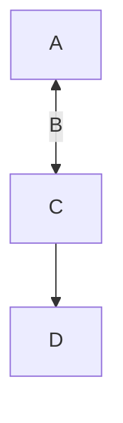

# [Dziban's Github page](https://github.com/dziban303)
This goes to a footnote for $\sqrt{3x-1}+(1+x)^2$ [^1]
## [TropicalWeather Discord server](https://discord.gg/tropicalweather)
### [/r/TropicalWeather](https://tropicalweather.reddit.com)

[^1]: what did you expect? 

**Well** this is **kind _of_ fuckin'** *weird* __don't *you* think__ ~~because it~~ `oh nevermind` ok

```python
@register(commands=['locate', 'find', 'latlng', 'latlong'])
class Locate(BaseWeather):
    elevation_api = "https://maps.googleapis.com/maps/api/elevation/json"
    #template = "{{ name|nc }}: {{ lat }}, {{ lng }} {{ 'Elevation'|tc }}: {{ elevation|int }}m ({{ elevation_ft|int }}ft)"
    template = "{{ name|nc }}: {{ lat }}, {{ lng }} | Sorry, the elevation shit is broken"

    def get_elevation(self, latlng):
        try:
```
```python-traceback
2022-07-10 22:48:55,856 INFO got command locate {'sender': 'dziban303', 'ident': ':dziban303!dziban303', 'mask': 'user/dziban303', 'chan': '#TropicalWeather', 'msg': 'locate charleston', 'command': 'locate', 'args': 'charleston', 'bot': <pythabot.Pythabot object at 0x7f842fa7f0>}
2022-07-10 22:48:56,381 ERROR 'elevation' is undefined
Traceback (most recent call last):
  File "/home/pi/virtualenvironment/pywx3/pywx/modules/base.py", line 101, in run
    reply = template.render(context)
  File "/home/pi/virtualenvironment/pywx3/lib/python3.9/site-packages/jinja2/environment.py", line 1301, in render
    self.environment.handle_exception()
  File "/home/pi/virtualenvironment/pywx3/lib/python3.9/site-packages/jinja2/environment.py", line 936, in handle_exception
    raise rewrite_traceback_stack(source=source)
  File "<template>", line 1, in top-level template code
  File "/home/pi/virtualenvironment/pywx3/lib/python3.9/site-packages/jinja2/filters.py", line 957, in do_int
    return int(value)
jinja2.exceptions.UndefinedError: 'elevation' is undefined
```

```python-console
2022-07-10 22:48:55,856 INFO got command locate {'sender': 'dziban303', 'ident': ':dziban303!dziban303', 'mask': 'user/dziban303', 'chan': '#TropicalWeather', 'msg': 'locate charleston', 'command': 'locate', 'args': 'charleston', 'bot': <pythabot.Pythabot object at 0x7f842fa7f0>}
2022-07-10 22:48:56,381 ERROR 'elevation' is undefined
Traceback (most recent call last):
  File "/home/pi/virtualenvironment/pywx3/pywx/modules/base.py", line 101, in run
    reply = template.render(context)
  File "/home/pi/virtualenvironment/pywx3/lib/python3.9/site-packages/jinja2/environment.py", line 1301, in render
    self.environment.handle_exception()
  File "/home/pi/virtualenvironment/pywx3/lib/python3.9/site-packages/jinja2/environment.py", line 936, in handle_exception
    raise rewrite_traceback_stack(source=source)
  File "<template>", line 1, in top-level template code
  File "/home/pi/virtualenvironment/pywx3/lib/python3.9/site-packages/jinja2/filters.py", line 957, in do_int
    return int(value)
jinja2.exceptions.UndefinedError: 'elevation' is undefined
```



```yml
version: '3.8'

volumes:
  readsbpb_rrd:
  readsbpb_autogain:
  tar1090_heatmap:
#  acars_data:
#  vnstatdb:

services:
  # The ADSB decoder
  readsb:
    image: ghcr.io/sdr-enthusiasts/docker-readsb-protobuf:latest
    tty: true
    container_name: readsb
    hostname: readsb
```
